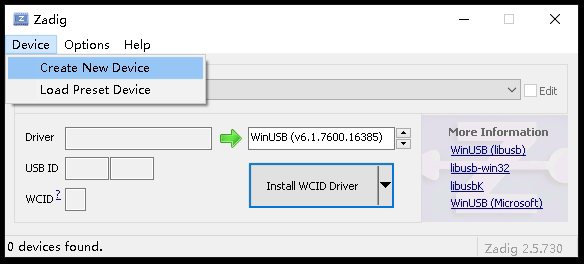
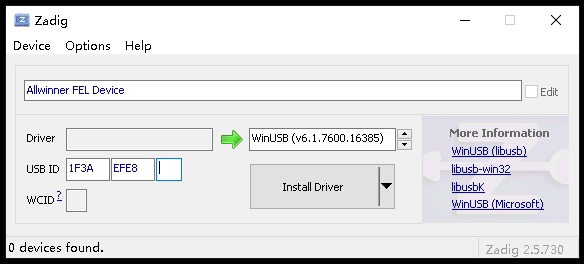
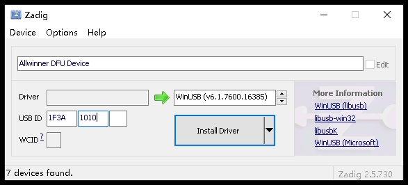
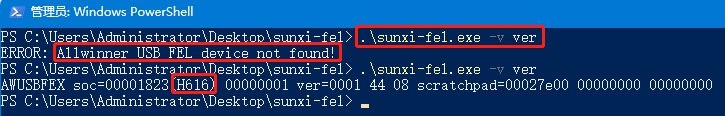

# Blueberry

蓝莓派，基于 [Yuzuki Chameleon](https://github.com/YuzukiHD/YuzukiChameleon) 二次开发。  
修改SCH原理图WiFi模块，替换为RTL8189ES。  
修改PCB适用与RTL8189ES。  


## 特点：

基于全志 H616 芯片，4*Cortex A53  
HDMI支持4K@60，支持最大 6K 视频解码  
最大 2GB 内存与 128GB eMMC 储存  
板载eMMC与TF卡槽  
板载 RTL8189ES WIFI芯片  
4个USB TypeC，3个HOST 一个 OTG，支持USB摄像头与采集卡输入  
板载风扇槽，散热器固定孔  
引出 RJ45 百兆接口  
板载 40 Pin GPIO，可以扩展 SPI LCD 显示屏，千兆以太网，麦克风阵列，CAN收发器，温湿度传感器，加速度传感器等等。  
AXP313A 电源方案  
  

## Allwinner H616

H616是全志科技为用户提供的新一代高画质64位4K@60fps解码SoC  
OTT 和 IPTV 市场。 集成四核64位CortexTM-A53处理器，以及全新G31 GPU  
支持OpenGL ES 3.2/Vulkan 1.1的ARM引擎。 此外，H616支持全格式4K@60fps  
10位超高清视频解码，全志自主研发的SmartColor3.3TM图像增强引擎，  
杜比和 DTS 音频处理。 H616采用新一代功耗技术，  
比上一代降低20%的功耗。  

  

## 硬件资料

原理图：  
[SCH_blueberry_2023-11-09.pdf](https://git.aixiao.me/aixiao/Blueberry/raw/branch/master/HW/blueberry/SCH_blueberry_2023-11-09.pdf)  
[嘉立创EDA项目:](https://lceda.cn/)    
[ProProject_blueberry_2023-11-09.epro](https://git.aixiao.me/aixiao/Blueberry/raw/branch/master/HW/blueberry/ProProject_blueberry_2023-11-09.epro)  
BOM:  
[BOM.xlsx](https://git.aixiao.me/aixiao/Blueberry/raw/branch/master/HW/blueberry/BOM.xlsx)  
Gerber:  
[Gerber_blueberry_2023-10-19.zip](https://git.aixiao.me/aixiao/Blueberry/raw/branch/master/HW/blueberry/Gerber_blueberry_2023-10-19.zip)  

H616 ds:  
[h616_datasheet_v1.0.pdf](https://git.aixiao.me/aixiao/Blueberry/raw/branch/master/HW/h616_datasheet_v1.0.pdf)  
H616 manual:  
[h616_user_manual_v1.0.pdf](https://git.aixiao.me/aixiao/Blueberry/raw/branch/master/HW/h616_user_manual_v1.0.pdf)  
AXP313a:  
[axp313a_datasheet_v0.1-20201105.pdf](https://git.aixiao.me/aixiao/Blueberry/raw/branch/master/HW/axp313a_datasheet_v0.1-20201105.pdf)  
RTL8189ES:  
[RTL8189ES_STAMP_Module-1V0.pdf](https://git.aixiao.me/aixiao/Blueberry/raw/branch/master/HW/RTL8189ES_STAMP_Module-1V0.pdf)  

## 构建系统

Linux Kernel: https://github.com/niuyuling/linux  
U-BOOT: https://github.com/niuyuling/u-boot  

如果自己构建请选择 [Debian GNU/Linux 12 (bookworm)](https://www.debian.org/) 系统并且安装 Docker version 24.0.7 磁盘不少于 60G，内存不少于 2G。[Docker 安装方法](https://docs.docker.com/engine/install/debian/)  
如果选择 ArmDebian 官方 [build](https://github.com/armbian/build) 构建系统，请下载补丁文件 [blueberry.patch](https://git.aixiao.me/aixiao/Blueberry/raw/branch/master/SF/ArmDebian/blueberry.patch)  
```
apt-get -y install git wget
git clone --depth=1 --branch=main https://github.com/armbian/build
wget https://git.aixiao.me/aixiao/Blueberry/raw/branch/master/SF/ArmDebian/blueberry.patch
cd build
git apply ../blueberry.patch # 打补丁
./compile.sh build BOARD=blueberry BRANCH=legacy BUILD_DESKTOP=no BUILD_MINIMAL=yes KERNEL_CONFIGURE=yes RELEASE=bookworm
```

如果使用 [build](https://git.aixiao.me/aixiao/build.git) 构建系统，是官方也非官方(二次修改)。  
```
apt-get -y install git
git clone --depth=1 --branch=main https://git.aixiao.me/aixiao/build.git
cd build
./compile.sh build BOARD=blueberry BRANCH=legacy BUILD_DESKTOP=no BUILD_MINIMAL=yes KERNEL_CONFIGURE=yes RELEASE=bookworm
```

预构建系统下载 https://blueberry.aixiao.me/images/  


## EMMc 刷入系统

[Windows 安装驱动](https://linux-sunxi.org/FEL/USBBoot#Using_sunxi-fel_on_Windows)  
针对FEL  
安装zadig后打开，选择"Device"→"Create New Device"  
  

按图中填写信息"Allwinner FEL Device" "1F3A:EFE8"  
  
然后点击"Install Driver"  

针对DFU  
再次选择"Device"→"Create New Device"  
  

按图中填写信息  
  
然后点击"Install Driver"  


编译可以在 Windows下识别Emmc设备为U盘的 u-boot  
```
# ARM TRUSTED FIRMWARE (ARM64)
git clone https://github.com/ARM-software/arm-trusted-firmware.git
cd arm-trusted-firmware
make CROSS_COMPILE=aarch64-linux-gnu- PLAT=sun50i-h616 DEBUG=1 bl31
cd ..

# 编译 U-BOOT
git clone https://github.com/niuyuling/u-boot.git
cd u-boot
git checkout v2023.07-blb
make CROSS_COMPILE=aarch64-linux-gnu- BL31=../arm-trusted-firmware/build/sun50i_h616/debug/bl31.bin blueberry_emmc_ums_defconfig
make CROSS_COMPILE=aarch64-linux-gnu- BL31=../arm-trusted-firmware/build/sun50i_h616/debug/bl31.bin

```

Windows刷机工具[SUNXI-FEL](https://github.com/eperie/build-scripts/releases/download/v1.3/sunxi-tools-mingw64-530adfa.zip)  
按住FEL键链接USB后执行刷入U-BOOT  
  
```
.\sunxi-fel.exe -v ver
```

```
.\sunxi-fel.exe uboot .\u-boot-sunxi-with-spl.bin
```

刷入u-boot后Windows 自动识别设备Emmc为u盘设备  
这时下载系统镜像刷入TF那样刷入Emmc设备  
Windows 刷机工具 [win32diskimager](https://sourceforge.net/projects/win32diskimager/)  


## 问题

目前未发现问题。  

## 配件

RJ45口需要自己制作，百M速率需要注意等长。  
RJ45_SCH  
  

RJ45_PCB  
  

RJ45_3D  
  

